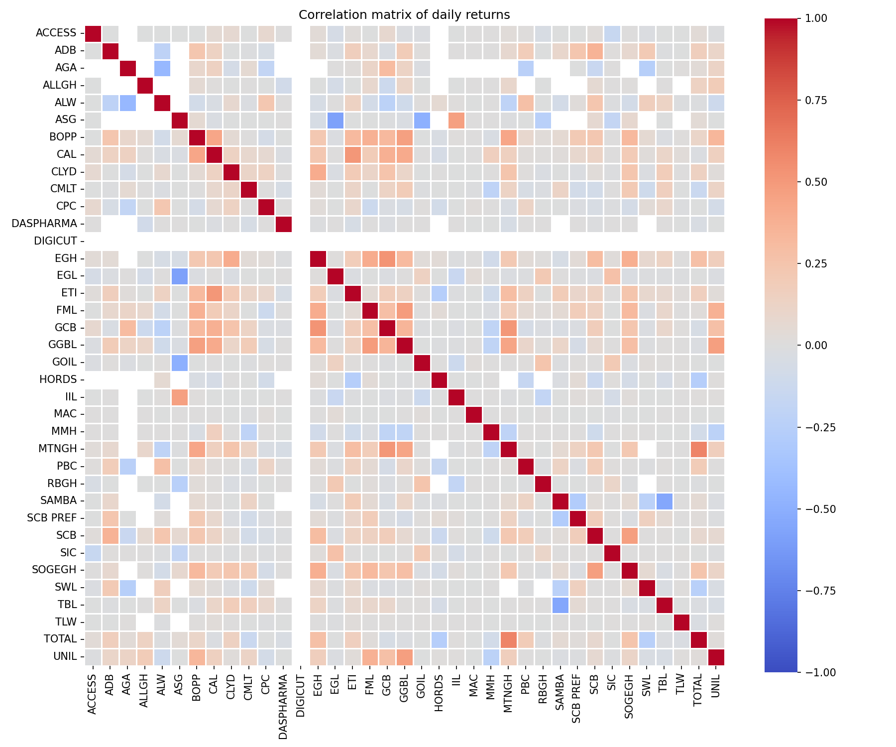
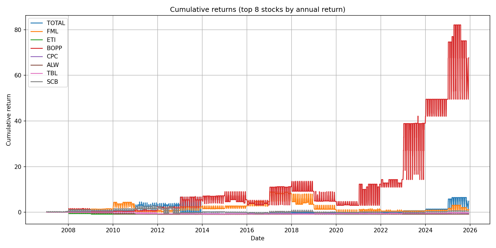
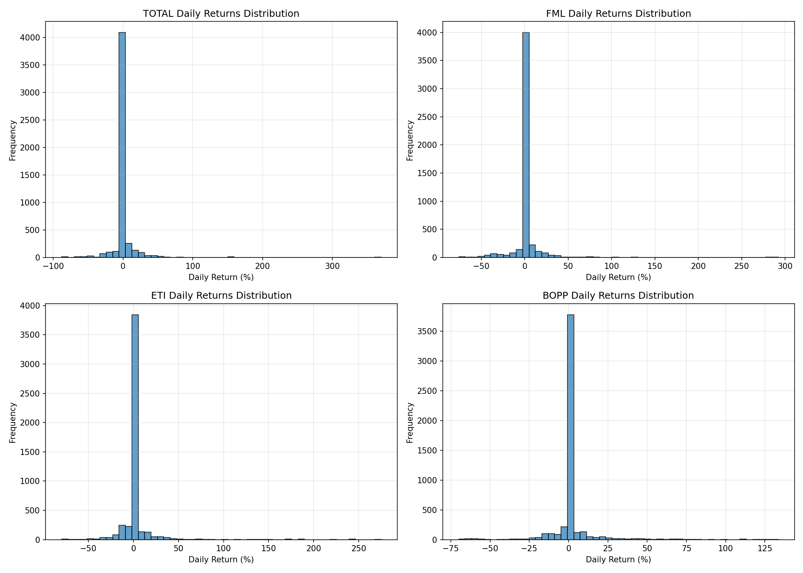
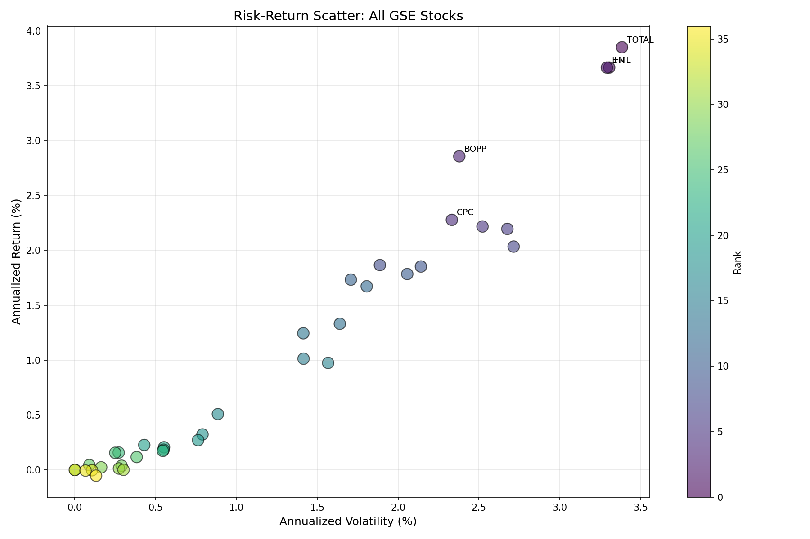
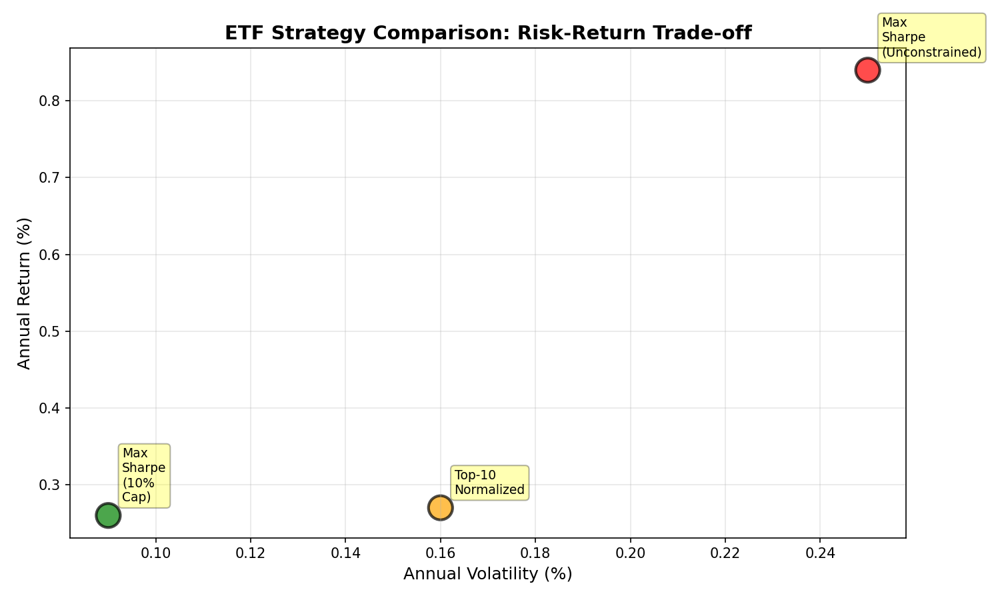
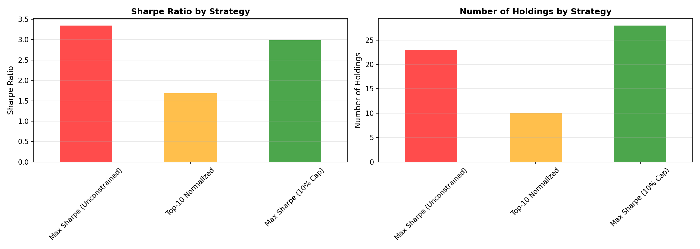

# Ghana Stock Exchange Analysis - From Scratch

This document describes the analysis performed in `src/gse_visual.ipynb`, which is a fresh, from-scratch analysis of Ghana Stock Exchange (GSE) historical data.

## Overview

The notebook loads raw CSV files from `src/historical_data/` and performs the following:

1. **Data Loading & Validation**
   - Loads 37 stock CSV files (2007–2025 data)
   - Validates date columns and close prices
   - Builds a unified price panel
# Ghana Stock Exchange (GSE) — Stock Analysis

Comprehensive, reproducible analysis of historical stock data from the Ghana Stock Exchange. This repository contains the raw CSV data, an exploratory Jupyter notebook, derived charts and CSV summaries, and a short findings report used to support portfolio and research decisions related to Ghana equities.

Key outputs: cleaned price panel, daily returns, summary metrics, visualizations, and a findings summary.

---

## Project summary

- **Goal:** Provide an end-to-end, reproducible analysis of GSE-listed equities (2007–2025) to surface risk/return characteristics and support simple portfolio construction and research.
- **Primary artifact:** `src/gse_visual.ipynb` — interactive analysis and processing pipeline.
- **Data:** CSV files in `src/historical_data/` (one file per ticker). A symbol reference is available in `gse_reference.json`.

## What you'll find in this repo

- `src/src/gse_visual.ipynb` — the main notebook that: loads data, cleans it, computes returns and metrics, and produces visualizations and CSV summaries.
- `src/historical_data/` — raw historical price CSVs (one per ticker).
- `src/charts/` — generated CSV summaries and chart exports (e.g., `metrics_summary.csv`, allocation outputs, strategy comparison CSVs).
- `gse_reference.json` — human-readable mapping of ticker symbols to company names / metadata.
- `FINDINGS_SUMMARY.txt` — short plain-text summary of the notebook's conclusions.

## Folder structure (important files)

- `README.md` — this file
- `requirements.txt` — Python dependencies
- `gse_reference.json` — ticker metadata
- `src/gse_visual.ipynb` — notebook
- `src/historical_data/*.csv` — input data files
- `src/charts/*.csv` and `src/charts/*.png` — outputs

## Quick start — run the analysis

1. Clone or open this repository.

2. Create a Python virtual environment and install dependencies (bash on Windows, WSL, macOS, Linux):

```bash
# create environment
python -m venv .venv

# activate (bash / WSL)
source .venv/Scripts/activate || source .venv/bin/activate

# install
pip install -r requirements.txt
```

If you prefer PowerShell on Windows:

```powershell
python -m venv .venv
. .venv\Scripts\Activate.ps1
pip install -r requirements.txt
```

3. Start Jupyter and open the notebook:

```bash
jupyter lab
# or
jupyter notebook
```

4. Open `src/gse_visual.ipynb` and run the cells top-to-bottom. The notebook will read CSVs from `src/historical_data/`, generate metrics, and save outputs to `src/charts/`.

## Key results and outputs

- `src/charts/metrics_summary.csv` — per-ticker summary metrics (mean daily return, annualized return, annualized volatility, Sharpe proxies).
- Allocation and strategy CSV exports: `etf_allocation_*.csv`, `etf_strategy_comparison.csv` — results from portfolio/ETF allocation experiments.
- Visualizations saved to `src/charts/` (correlation heatmap, cumulative returns, distributions, risk-return scatter, etc.).

## Visualizations

Key charts produced by the analysis are saved in `src/charts/`. They are embedded below for quick reference — open the PNG files directly for full-resolution versions.

- **Correlation heatmap** — correlation matrix of daily returns across all stocks



- **Cumulative returns** — cumulative return curves for the top stocks by annual return



- **Returns distribution** — histograms of daily returns for the top stocks



- **Risk vs Return scatter** — annualized return vs. annualized volatility for all stocks



- **ETF strategy comparison (risk-return)** — risk/return positions for the three allocation strategies



- **Strategy comparison (bars)** — Sharpe ratio and holdings comparison across strategies



- **Top holdings (pie charts)** — top holdings across the three strategies for visual comparison


> Tip: To regenerate these charts, run `src/analysis_from_scratch.ipynb` top-to-bottom after activating the project's virtual environment.

## Methodology (high-level)

- Load per-ticker daily price CSVs and normalize dates into a single DataFrame (price panel).
- Compute daily percentage returns, handle missing values using forward-fill then drop residual NaNs where necessary.
- Calculate annualized return and volatility using a 252-trading-day convention.
- Produce visualizations (correlation matrix, cumulative return curves, histograms) and CSV summaries for downstream analysis.

## Reproducibility notes

- The notebook is written to be reproducible: rerunning cells in order should recreate `src/charts/` outputs.
- If you add or change CSVs in `src/historical_data/`, re-run the notebook cells that build the price panel and recompute metrics.

## Dependencies

All runtime dependencies are listed in `requirements.txt`. The analysis uses standard scientific Python packages (pandas, numpy, matplotlib, seaborn) and Jupyter.

## Suggested next steps (for researchers / contributors)

- Add unit tests for the data-cleaning functions (if extracted to scripts).
- Add a small CLI or Python script to programmatically regenerate charts for CI.
- Expand analysis: sector-level aggregation, dividend-adjusted returns, factor regressions, or backtests for simple strategies.

## Contributing

- Open an issue for any data problems, requests, or improvements.
- If you're submitting code, please target the `main` branch via pull request and include a short description and repro steps.

## License & attribution

- This project is provided under the repository `LICENSE` file. Review it for permitted usage.

## Contact

- For questions or collaboration, open an issue in this repository or reach out to the repository owner.

---

